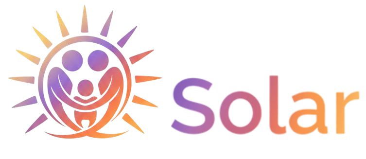
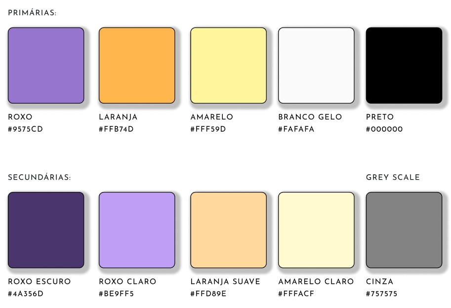
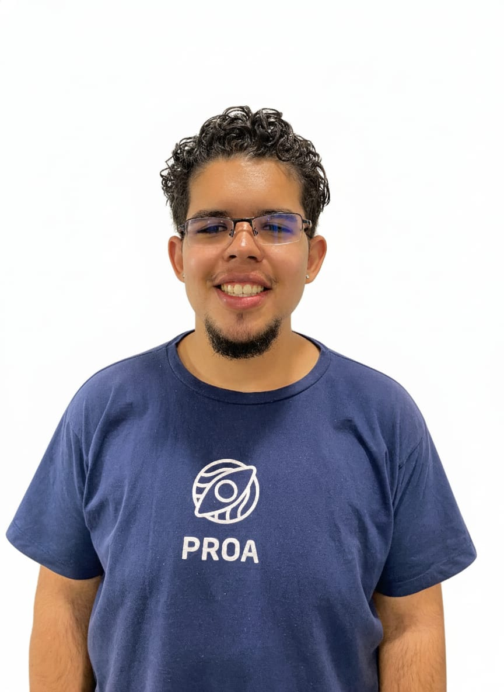
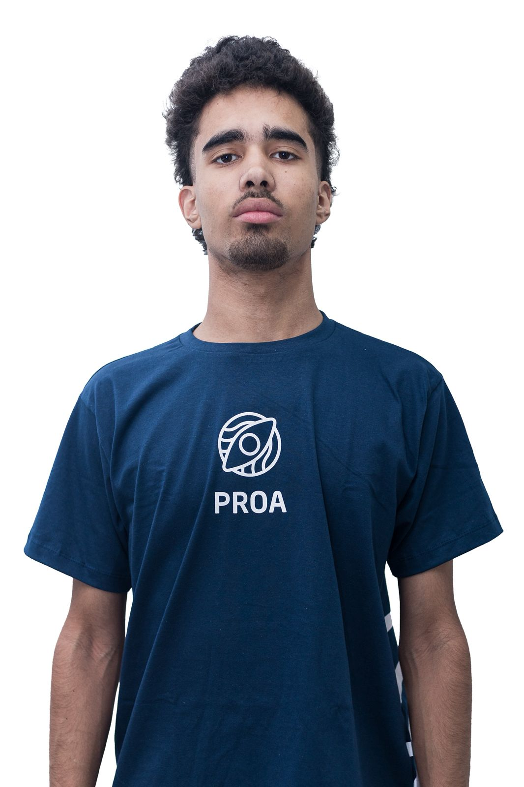
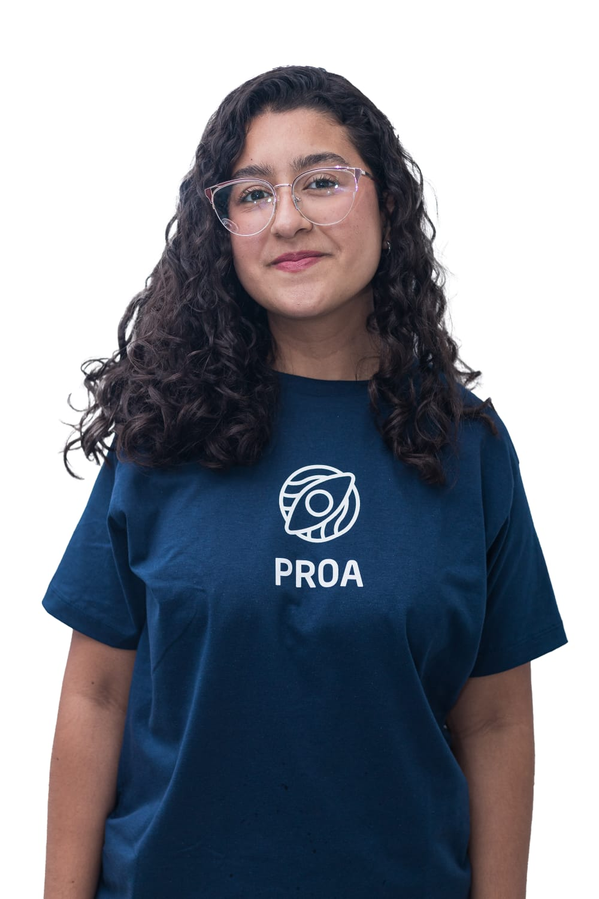
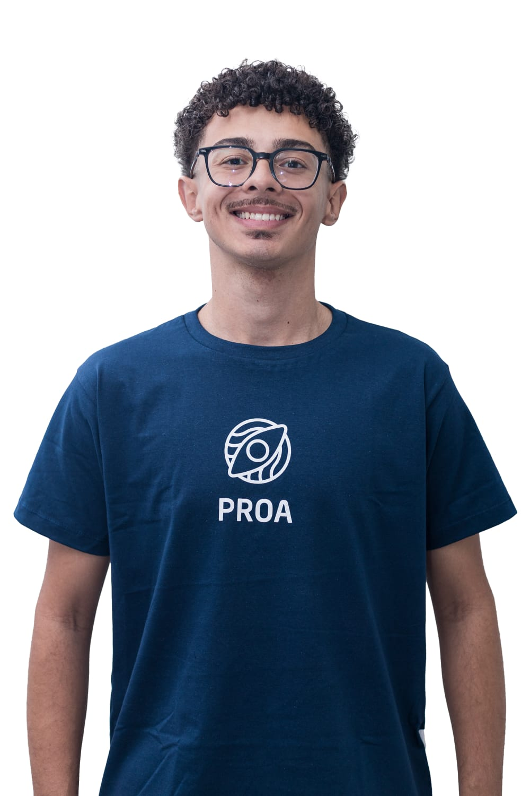
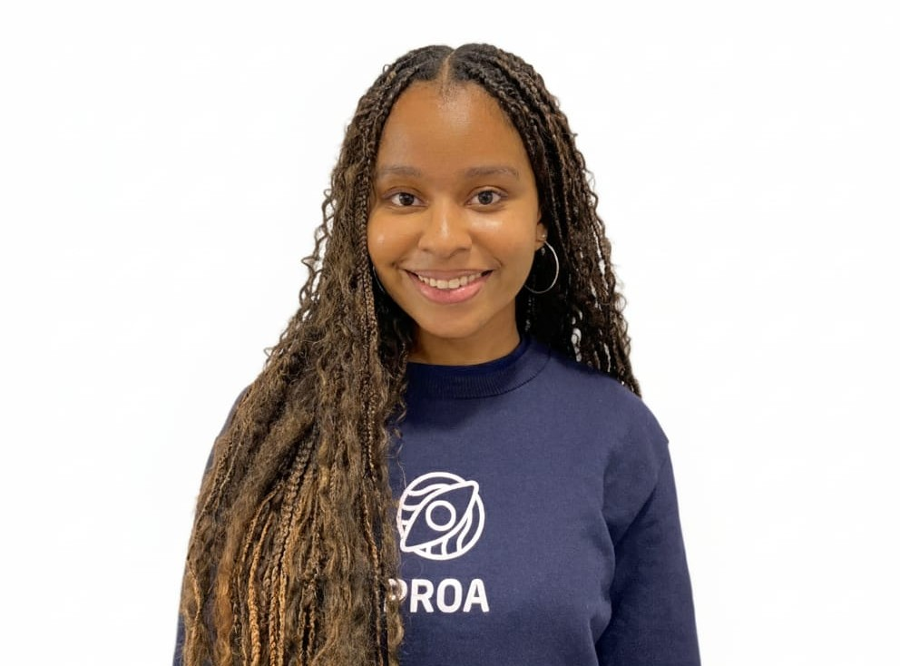
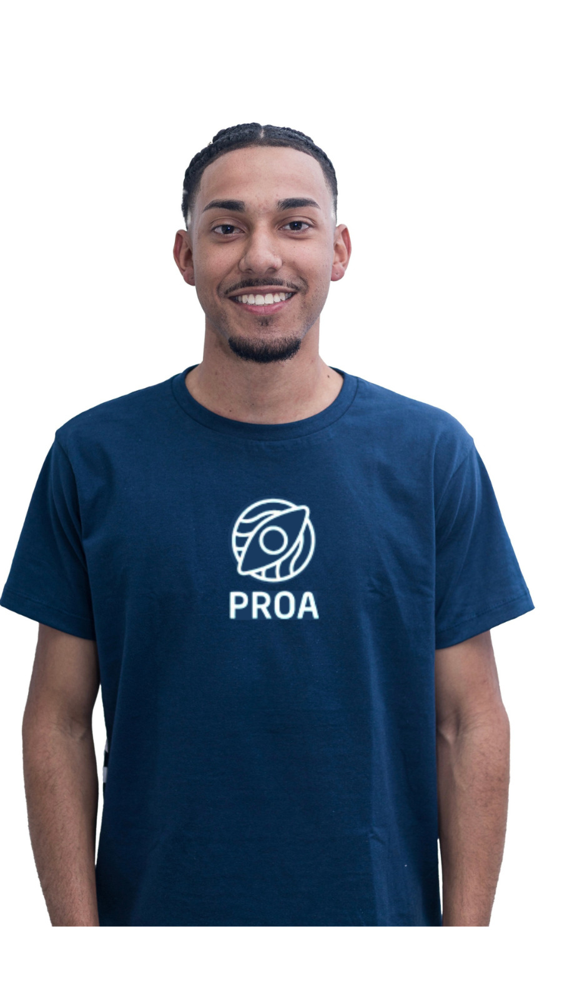

<h1 align="center"><b>Olá! Somos a SOLAR 🌞</b></h1>

  

<h2><b>Propósito:</b></h2>

  Acreditamos que nenhum pai ou mãe deveria enfrentar tudo sozinho. Nossa razão
  de existir é ser um ponto de apoio e acolhimento para quem carrega o peso e o
  amor de cuidar sozinho. Criamos um espaço onde é possível encontrar escuta,
  informação e conexões reais com pessoas, serviços e oportunidades que fazem
  diferença no dia a dia. Queremos iluminar caminhos, fortalecer laços e mostrar
  que, mesmo nas fases mais difíceis, sempre há calor, esperança e força para
  recomeçar. Porque ninguém deve caminhar sozinho. E juntos, a gente brilha mais
  forte. ☀️

<h2>🎯 <b>Missão:</b></h2>

  Oferecer apoio integral a mães e pais solos, promovendo inclusão,
  empoderamento e acesso a oportunidades de educação, trabalho e bem-estar.

<h2>👁️ <b>Visão:</b></h2>

  Ser referência em São Paulo no apoio a famílias monoparentais, criando uma
  rede de solidariedade, capacitação e fortalecimento social.

<h2>👐 <b>Valor:</b></h2>

  Na Solar, acreditamos que nenhuma mãe ou pai deveria enfrentar tudo sozinho.
  Nossa razão de existir é ser um ponto de apoio e acolhimento para quem carrega
  o peso e o amor de cuidar sozinho.

<h2>🎨 <b>Paleta:</b></h2>

  

<h2 align="center">🚀 <b>Stack de Tecnologias:</b></h2>

  
  
  
  
  
  
  
  

<h2 align="center">📫 <b>Contato:</b></h2>

  
  
  

<h2 align="center">🫂 <b>Conheça a equipe:</b></h2>

<table align="center">
  <tr>
    <td align="center">
      <a href="https://www.linkedin.com/in/giovanni-carvalho-/" target="blank">
        
         <b>Giovanni</b>
      </a>
       Product Owner  Financeiro
    </td>

    
    <td align="center">
      <a href="https://www.linkedin.com/in/camille-cordeiro/" target="blank">
        
         <b>Camille</b>
      </a>
       Scrum Master  Desenvolvedora Back-End
    </td>

    
    <td align="center">
      <a href="https://www.linkedin.com/in/luiz-fsfagundes/" target="blank">
        
         <b>Luiz Fellipe</b>
      </a>
       Desenvolvedor Back-End  UI/UX
    </td>

    
    <td align="center">
      <a href="https://www.linkedin.com/in/karina-fabricio/" target="blank">
        
         <b>Karina</b>
      </a>
       Desenvolvedora FullStack  Marketing
    </td>
  </tr>
  <tr>

    
    <td align="center">
      <a href="https://www.linkedin.com/in/gabrielbatistela/" target="blank">
        
         <b>Gabriel</b>
      </a>
       Desenvolvedor Front-End
    </td>

    
    <td align="center">
      <a
        href="https://www.linkedin.com/in/larissaolivsantos07/"
        target="blank"
      >
        
         <b>Larissa</b>
      </a>
       Desenvolvedora FullStack  Banco de Dados
    </td>

    
    <td align="center">
      <a href="https://www.linkedin.com/in/thallyabianka/" target="blank">
        
         <b>Thallya</b>
      </a>
       Marketing e UI/UX
    </td>

    
    <td align="center">
      <a href="https://www.linkedin.com/in/igor-limasilva/" target="blank">
        
         <b>Igor</b>
      </a>
       Desenvolvedor FullStack  Banco de Dados
    </td>
  </tr>
</table>

  <b
    >Conectar, apoiar e fortalecer pais e mães solos por meio de
    tecnologia, acolhimento e informação. 💜</b
  >

